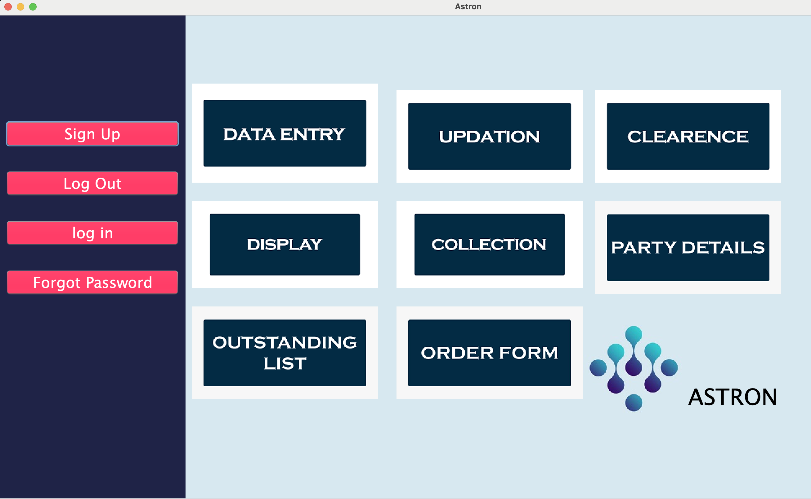
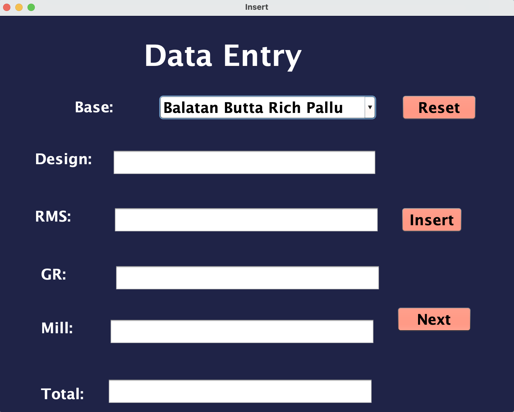
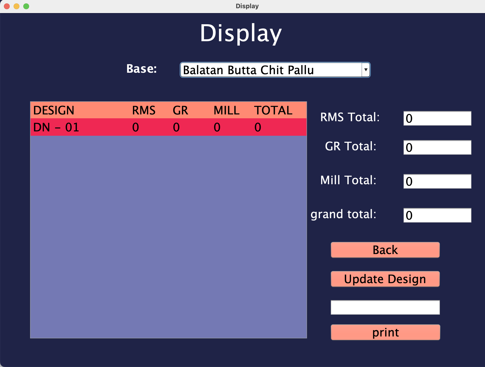
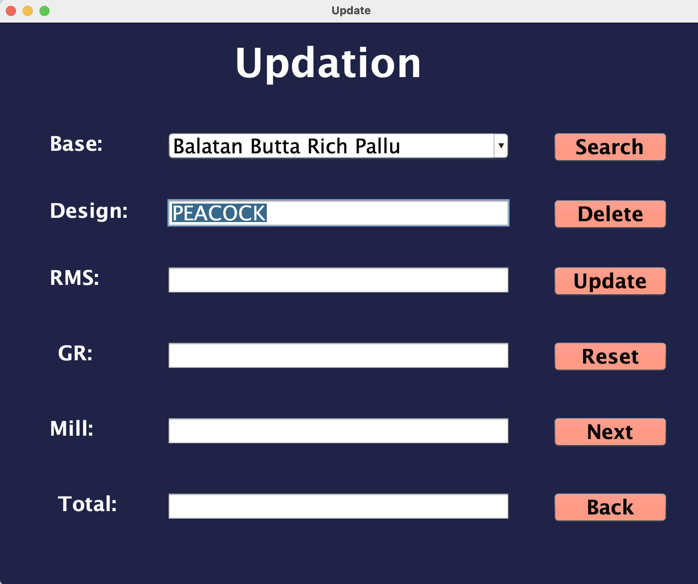
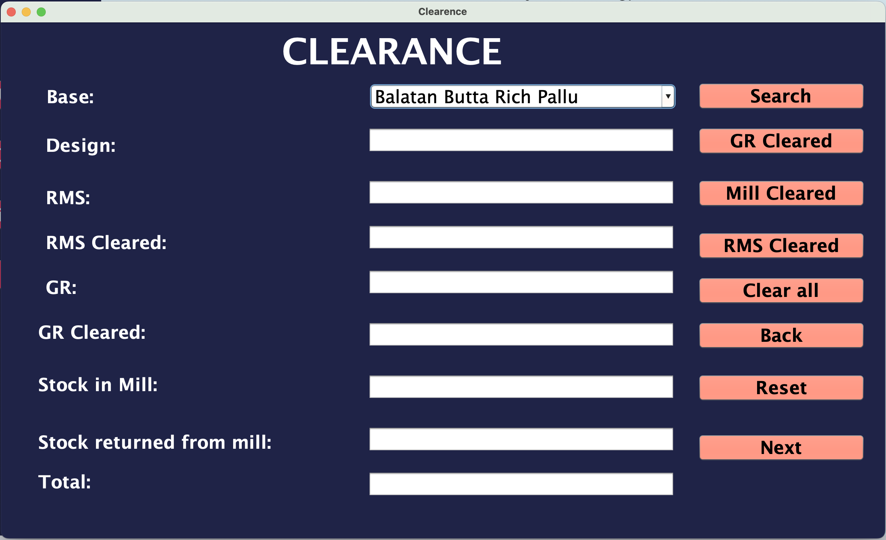
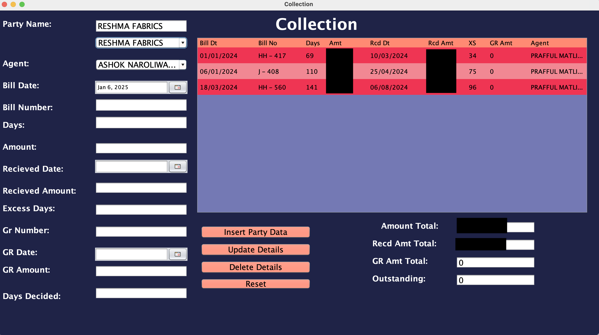
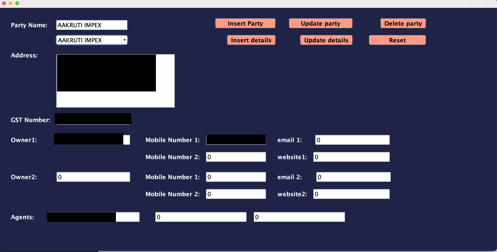
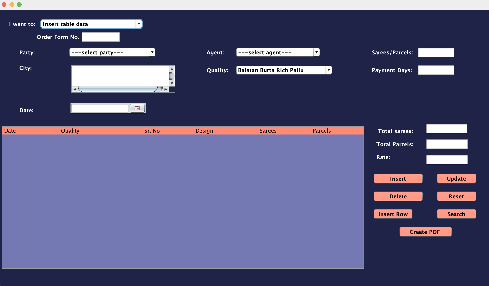

# 🏢 Astron: Business Management System

> **Production desktop application for manufacturing operations management**

**In Production Since 2021 | 4+ Years Operational | 25,000+ Records**

## 📖 Overview

Astron is a comprehensive business management desktop application built for a textile manufacturing company to centralize and automate their operations. The system replaced error-prone Excel-based workflows, providing a robust solution for managing sales, inventory, dealer relationships, and financial tracking.

**Impact:**
- ✅ Manages **25,000+ records** across sales, inventory, and dealer data
- ✅ **4+ years in continuous production use** with zero downtime
- ✅ Automated PDF order form generation saving hours of manual work
- ✅ Real-time stock tracking and financial reporting
- ✅ Eliminates data entry errors through validation and constraints

**Tech Stack:** Java Swing, MySQL (AWS RDS), JasperReports

## ✨ Key Features

### 📦 **Stock Management**
- **Data Entry** - Record current inventory levels
- **Display** - View all stock with real-time totals
- **Updation** - Modify or delete existing stock records
- **Clearance** - Track production workflow from raw materials to finished products

### 💼 **Dealer Management**
- **Party Details** - Comprehensive dealer database (name, address, phone, GST, agents)
- **Collection** - Track all deals, payments received, defective returns (GR), outstanding amounts
- **Outstanding List** - Monitor pending payments from all dealers

### 📄 **Automated Invoicing**
- **Order Form Generator** - Create professional PDF invoices with JasperReports
- Company letterhead and footer integration
- Product details, quantities, and pricing calculations
- One-click PDF generation for dealer distribution

## 🖥️ Application Screenshots

### Main Dashboard

  
   
  <i>Main navigation with access to all 8 modules</i>

**Modules:**
- **Stock Management:** Data Entry, Updation, Clearance, Display
- **Dealer Operations:** Collection, Party Details, Outstanding List
- **Document Generation:** Order Form (PDF Invoices)

### Stock Management

#### Data Entry

  
   
  <i>Simple form to record current inventory levels by Base, Design, RMS, GR, Mill</i>

**Features:**
- Select product Base (type)
- Enter Design name
- Input quantities: RMS, GR, Mill
- Automatic total calculation
- Quick insert functionality

#### Display Module

  
   
  <i>Comprehensive view of all current inventory with real-time totals</i>

**Capabilities:**
- Search by Base (product category)
- Tabular display of all stock (Design, RMS, GR, Mill, Total)
- **Real-time totals:** RMS Total, GR Total, Mill Total, Grand Total
- Update design information
- Print stock reports

#### Updation Module

  
   
  <i>Edit or delete existing stock records</i>

**Operations:**
- Search existing records by Base
- Update Design, RMS, GR, Mill quantities
- Delete outdated records
- Reset form

#### Clearance Tracking

  
   
  <i>Track production workflow from raw materials to finished goods</i>

**Tracks:**
- RMS Cleared (materials processed)
- GR Cleared (goods received)
- Stock in Mill (currently in production)
- Stock returned from mill (completed/returned items)
- Total stock calculations across production stages

### Dealer & Financial Management

#### Collection Management

  
   
  <i>Comprehensive payment tracking for all dealer transactions</i>

**Manages:**
- Party Name and Agent assignment
- Bill Date, Bill Number, Days outstanding
- Amount billed and Amount received
- Received Date tracking
- **GR Amount** (Goods Returned/Defective products)
- **XS** (Excess/shortage)
- Days Decided (payment terms)
- Outstanding balance calculations

#### Party Details

  
   
  <i>Complete dealer database with contact information and business details</i>

**Stores:**
- Party Name and full Address
- GST Number
- Owner details (supports 2 owners)
- Multiple mobile numbers and email addresses
- Website information
- Agent assignments
- Insert, Update, Delete, Reset operations

### Order Form Generation

#### Invoice Creation

  
   
  <i>Order form creation with automated PDF generation using JasperReports</i>

**Features:**
- **Insert table data** dropdown for operation selection
- Order Form Number generation
- Party and Agent selection
- Quality specification
- Sarees/Parcels quantity tracking
- Payment Days terms
- **Dynamic product table:** Date, Quality, Sr. No, Design, Sarees, Parcels
- Automatic totals calculation
- **Create PDF** button generates professional invoice with:
  - Company letterhead
  - Product details and quantities
  - Pricing calculations
  - Company footer

## 🛠️ Tech Stack

**Frontend:** Java Swing (GUI Framework)  
**Backend:** Java (Business Logic & Controllers)  
**Database:** MySQL (hosted on AWS RDS)  
**Cloud Infrastructure:** AWS RDS with daily automated backups  
**Report Generation:** JasperReports (Professional PDF invoices)  
**Distribution:** JAR executable file

**Key Technologies:**
- **JDBC** - Database connectivity and SQL operations
- **Swing Components** - Desktop UI (forms, tables, buttons)
- **JasperReports Engine** - Template-based PDF generation
- **AWS RDS** - Managed MySQL database service

## 🔐 Database Schema

**Key Tables:**
- **Stock** - Inventory tracking (Base, Design, RMS, GR, Mill quantities)
- **Parties** - Dealer/customer information
- **Collection** - Payment and billing records
- **Orders** - Order form details
- **Agents** - Sales agent information

**Hosted on AWS RDS (MySQL)** with automated backups and data integrity constraints

## 📊 System Capabilities

### Data Management
- **25,000+ records** managed across all modules
- CRUD operations (Create, Read, Update, Delete) on all entities
- Data validation and integrity constraints
- Automated calculations and totals

### Reporting
- **Automated PDF generation** using JasperReports
- Company-branded order forms with letterhead/footer
- Customizable report templates (.jrxml files)
- One-click report generation

### Business Logic
- Real-time stock calculations
- Outstanding payment tracking
- Days overdue calculations
- Multi-category inventory management

## 🚀 Production Deployment

**Deployment Details:**
- **Platform:** Desktop application (Windows/Mac/Linux compatible)
- **Database:** MySQL on AWS RDS (Relational Database Service)
- **Year Deployed:** 2021
- **Uptime:** 4+ years continuous operation
- **Users:** Manufacturing business owner + staff

**Infrastructure:**
- AWS RDS for managed MySQL database with **automated daily backups**
- Point-in-time recovery capability
- Secure VPC configuration for data protection
- High availability and fault tolerance

**Maintenance:**
- **Daily automated backups** via AWS RDS snapshots
- Ongoing support and bug fixes as needed
- Feature enhancements based on evolving business needs
- Consistent performance optimization

## 🎯 Business Impact

**Problem Solved:**

Prior to Astron, the manufacturing business relied on manual Excel spreadsheets for all operations, leading to:
- ❌ Frequent data entry errors
- ❌ Hours spent on manual order form creation
- ❌ Difficulty tracking outstanding payments
- ❌ No centralized dealer database
- ❌ Inefficient stock management

**Solution Delivered:**
- ✅ **Eliminated data entry errors** through validation and automated calculations
- ✅ **Reduced order processing time from hours to minutes** via automated PDF generation
- ✅ **Centralized 25,000+ records** in searchable, organized database
- ✅ **4+ years of operational stability** supporting daily business operations
- ✅ **Zero downtime** since production deployment in 2021

## 📧 Contact

**Vaishnavi Jariwala**  
MS Computer Science @ Northeastern University  
📧 jariwala.vai@northeastern.edu | 💼 [LinkedIn](https://www.linkedin.com/in/vaishnavijariwala/)

## 📝 License

This is proprietary software developed for a manufacturing business. Code is available for portfolio demonstration purposes.

  <i>⭐ Built with Java Swing, MySQL on AWS RDS, and JasperReports</i>

